# Summary

|      ID       |         Name          |      Contribution       |
| :-----------: | :-------------------: | :---------------------: |
| 2020A7PS0080U |     Bharathwaj M      |         Queries         |
| 2020A7PS0107U | Ishan Anthony Menezes |     Queries, RA, RC     |
| 2020A7PS0128U |   Anurag Kumar Jha    |   Application Backend   |
| 2020A7PS0198U |     Ahmed Thahir      | Diagrams, Documentation |
| 2020A7PS0221U |  Anmol Deepak Kumar   |  Normalization, Report  |

## Title

Recruitment Database Management System

## Repository

The code and the documentation for this project is available on this [Github Repo](https://github.com/AhmedThahir/DBMS/).

## Concepts Used

- [x] ER Model
- [x] ER Diagram
- [x] Relational Model
- [x] Schema Diagram
- [x] Tuple Relational Calculus
- [x] Domain Relational Calculus
- [x] Normalization (1NF, 2NF, 3NF)
- [x] mySQL
  - [x] Queries
  - [x] Subqueries
  - [x] Joins
  - [x] Functions
  - [x] Procedures
  - [x] Triggers

- [x] GUI implementation

# Acknowledgement

Firstly, we would like to thank our family and friends for their constant support throughout our academic life and for this project in particular. They are who inspire us to keep marching forward in our academic journey.

Secondly, we would like to express our sincere gratitude to all Department of Computer Science Professors for allowing us to apply our expertise in this assignment. This project has been a very good opportunity to test our skills.

Thirdly, we would like to thank Mr. Ahamed Jameel, who proposed this idea to help out his (and Thahir’s) hometown get better employment opportunities in the UAE. His guidance and ideas throughout this project have been insightful and valuable. We hope that this project turns out to be fruitful and helps out a lot of people.

Furthermore, we would like to thank our university BITS Pilani, Dubai Campus for providing us with the required infrastructure to facilate efficient learning, especially at the time of a [declining] pandemic.

Lastly, our humble and noteworthy appreciation is due to Ms. Sapna Sadhwani, Dr. Tamizharasan Periyaswamy and Dr. Pramod Gaur for their guidance and assistance in the completion of this assignment. We are also grateful to all the Department of Computer Science faculty for giving us the required knowledge to program using the mySQL querying language to implement our ideas for this project.

[toc]

# Introduction

## Historical Background

The job industry is booming with millions of job seakers each years. One of the most crucial elements which the job industry depends upon is the Database Management System, which is used to store, organize and retrieve the details of applicants. This requires a robust and efficient design of the Database to manage the data so that it can be accessed, modified, and stored quickly, with minimal storage space.

Thahir’s hometown Kayalpatnam currently has a large number of job seekers in the UAE. We would like to use this application to help them reach potential employers.

## Theory

The following is the theory relevant to this project.

### Database

A database is a collection of data.

### Relational Database

A database is a collection of data, in the form of rows and columns.

### Transaction

A transaction is an atomic unit of a database operation. Hundreds of transactions may take place concurrently at any instant. A transaction may be one of the CRUD operations

- Create
- Read
- Update (or Insert)
- Delete

### DBMS

A ‘DataBase Management System’ is a system for handling large amounts of data stored in one or more databases. It is also called as a ‘Transaction Processing System’.

### Querying Language

A querying language is a set of commands that facilitates database operations.

### Database Design

There are various ways of designing the structure(schema) of a database. The database must be designed well before inserting values, to ensure inconsistencies.

The logical schema depicts the structure of the database, showing the tables, columns, and relationships with other tables in the database, and is a direct mapping of the Entity-Relationship diagram. The physical schema is created by actually generating the tables, columns, and relationships in the DBMS, using a querying language.

Relational databases are ACID-compliant, but NoSQL aren’t

- Atomicity
  If any sub-steps of a transaction fails, the whole transaction must fail and the database must be in the same state as the original.
- Consistency
  Correct data is ensured through constraints
- Isolation
  Concurrent-Execution Safe
  Simultaneous transactions must be considered as multiple sequential transactions.
- Durability
  Committed transactions must be stored to a non-volatile memory, to prevent loss of data.

### ER Model

A database is modelled as

- entity set
- relationship sets

| Term                       | Meaning                                                  | Example                                         |
| -------------------------- | -------------------------------------------------------- | ----------------------------------------------- |
| Entity                     | unique object                                            | specific person, company                        |
| Entity Set                 | set of entities                                          |                                                 |
| Attributes                 | properties/features of an entity/relationship            | name, age                                       |
| Composite Attributes       | sub-attributes                                           | first name, last name                           |
| Relationship               | association among several entites                        |                                                 |
| Relationship Sets          | set of relationships                                     |                                                 |
| Degree of Relationship Set | no of entity sets that participate in a relationship set |                                                 |
| Mapping Cardinalities      | Type of mapping                                          | One-One<br/>One-Many<br/>Many-One<br/>Many-Many |

### ER Diagram

A diagrammatic representation of the entities and relations used.

| Shape            | Meaning                                                      |
| ---------------- | ------------------------------------------------------------ |
| Rectangle        | Entity Set                                                   |
| Double Rectangle | Weak Entity Set<br />entity without a primary key            |
| Diamond          | Relationship Set                                             |
| Double Diamond   | Weak Relationship Set<br />relation connecting a weak entity with something else |
| Ellipse          | Attribute                                                    |
| Dashed ellipse   | Derived attribute                                            |
| Double ellipse   | Multi-valued attribute                                       |
| Underline        | Primary Key Attribute                                        |
| Triangle         | ‘is-a’ relation                                              |
| Lines            | - Link attribute **to** entity set<br />- Link entity set **to** relationship set |
| $\to$            | one                                                          |
| $-$              | many                                                         |

### Relational Model

A database is a collection of relations, where each relations is a table.

### Schema Diagram

A diagrammatic representation of the relations used.

### Normalization

It is the process of structuring a database, usually a relational database, in accordance with a series of so-called normal forms in order to reduce data redundancy and improve data integrity.

|                               | 1NF  | 2NF  | 3NF  | BCNF | 4NF  | 5NF  |
| ----------------------------- | :--: | :--: | :--: | :--: | :--: | :--: |
| No Multi-Valued Attributes    |  ✅   |  ✅   |  ✅   |  ✅   |  ✅   |  ✅   |
| No Partial Dependency         |      |  ✅   |  ✅   |  ✅   |  ✅   |  ✅   |
| No Transitive Dependency      |      |      |  ✅   |  ✅   |  ✅   |  ✅   |
| LHS = Candidate/Super Key     |      |      |      |  ✅   |  ✅   |  ✅   |
| No Multi-Attribute Dependency |      |      |      |      |  ✅   |  ✅   |
| Lossless Decomposition        |      |      |      |      |      |  ✅   |

## Tools

| Tool      | Full Form                                   | Use                                                          |
| --------- | ------------------------------------------- | ------------------------------------------------------------ |
| HTML      | HyperText Markup Language                   | Layout of web pages                                          |
| CSS       | Cascading Style Sheets                      | Design of web pages                                          |
| Bootstrap |                                             | CSS framework for developing responsive web pages            |
| Php       | Hypertext Preprocessor                      | Backend<br />- Calling SQL<br />- Serving dynamic content to user |
| mySQL     | My Structured Query Language                | Structured Relational Database Querying Language             |
| Xampp     | cross-platform, Apache, MySQL, PHP and Perl | - Database manipulation<br />- Locally hosting the website   |

## Limitations

The following are the drawbacks of our project. We plan on addressing these issues in the future.

1. Dynamic Sites are not as performant as static sites
2. Filters are not dynamic currently (it is hard-coded)
3. There are a few hyperlinks which don’t work properly.
   For example, report button down as the site is not hosted on any server
4. The webpage is hosted locally at the moment. Needs to be run on the server
4. Relational database paradigm is not the most efficient to deal with a networking model, with unstructured data. A NoSQL paradigm could be used in the future to deal with large loads.

# ER Diagram


# Normalization

In this project, we have only reached till 3NF. This is because BCNF and onwards may lead to lossy decomposition, with respect to the functional dependencies.

## Functional Dependencies

```
admin → id_admin, username, password
```

```
apply_job_post → id_apply, id_jobpost, id_company, id_user, status
```

```
cities → id,name,state_id
```

```
company → id_company, name, companyname, country, state, city, contactno, website, email, password, aboutme, logo, createdAt, active
```

```
countries → id, country_code, name, phonecode
```

```
job_post → id_jobpost, id_company, jobtitle, description, minimumsalary, maximumsalary, experience, qualification, createdat
```

```
mailbox → id_mailbox, id_fromuser, fromuser, id_touser, subject, message, createdAt
```

```
reply_mailbox → id_reply, id_mailbox, id_user, usertype, message, createdAt
```

```
states → id, name, country_id
```

```
users → id_user, firstname, lastname, email, password, address, city, state, contactno, qualification, stream, passingyear, dob, age, designation, resume, hash, active, aboutme, skills
```

## 1NF

```
R(id_admin, username, password, id_apply, id_jobpost, id_company, id_user, status, id, name, state_id, id_company, name, companyname, country, state, city, contactno, website, email, password, aboutme, logo, createdat, active, id, country_code, name, phonecode, id_jobpost, id_company, jobtitle, description, minimumsalary, maximumsalary, experience, qualification, createdat, id_mailbox, id_fromuser, fromuser, id_touser, subject, message, createdAt, id_reply, id_mailbox, id_user, usertype, message, createdAt, id, name, country_id, id_user, firstname, lastname, email, password, address, city, state, contactno, qualification, stream, passingyear, dob, age, designation, resume, hash, active, aboutme, skills)
```

## 3NF

```
R1(id_admin, username, password)
```

```
R2(id_apply, id_jobpost, id_company, id_user,status)
```

```
R3(id, name, state_id)
```

```
R4(id_company, name, companyname, country, state, city, contactno, website, email, password, aboutme, logo, createdat, active)
```

```
R5(id, country_code, name, phonecode)
```

```
R6(id_jobpost, id_company, jobtitle, description, minimumsalary, maximumsalary, experience, qualification, createdat)
```

```
R7(id_mailbox, id_fromuser, fromuser, id_touser, subject, message, createdat)
```

```
R8(id_reply, id _mailbox, id_user, usertype, message, createdAt)
```

```
R9(id, name, country_id)
```

```
R10(id_user, firstname, lastname, email, password, address, city, state, contactno, qualification, stream, passingyear, dob, age, designation, resume, hash, active, aboutme, skills)
```

# Schema Diagram

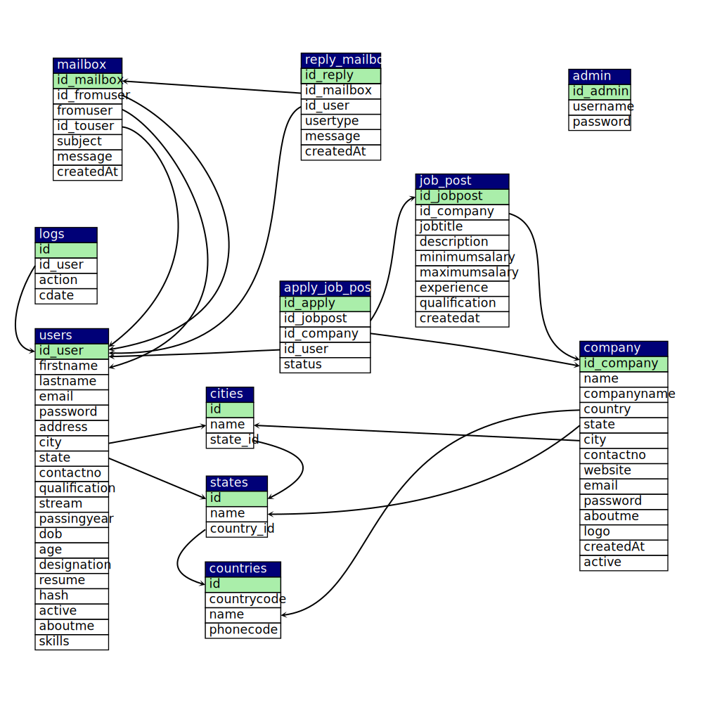

# Design

|                Table                | Details                                                      |
| :---------------------------------: | ------------------------------------------------------------ |
|               `admin`               | - admin username<br />- admin password<br />- Holds details about the active companies registered, candidates registered, total job posts and total applications.<br />- Permissions to remove any user or candidate<br />- Any company before being able to recruit and post jobs must be verified by the admin. |
|          `job_post table`           | - details of jobs posted by a company.<br />- contains the id of the company which posted the job, the job title and desription.<br/>- contains minimum salary , maximum salary, and qualifications for filtering out candidates.<br />- `createdat` attribute is used for showcasing the latest 4 jobs in the home page. |
|          `apply_job_post`           | Id_apply: acts as primary key with auto increment on<br/>Id_job_post: acts as the id for the GET method of php for opening the specific webpage having job<br/>decription<br/>Id company/user : id of user or the company<br/>Status: status of the job post depending on the admin. A job post is published only after validation by the admin. |
| `City`<br />`state`<br /> `country` | - Large database of the cities, states and tables connected together by id of state and<br/>countries.<br />- Created separately since while creating forms the option to select country comes first, then the state and then the city.<br />- None of these are compulsory so the 3 tables are kept separately so that if a user only provides country or country-state it works as well. |
|              `Company`              | - Consists of all the details of the country. The logo is stored as image format in the uploads folder.<br />- Any company before being to operate must be able to be verified from the admin when their active column changes from 2 to 1. |
|               `Users`               | - Similar to the companies these include all the users looking for jobs.<br />- The resume is stored as pdf(size smaller than 5 mb) and is stored in the uploads folder.<br />- The passwords are stored after applying decoding so that even the admin or the superuser can’t access the password. |
|               `Logs`                | - contains the log of user activity<br />- updated with the activity of user whenever a new user is created, updated or deleted. |
|       `Mailbox`<br />`Reply`        | - Inbuilt mailing technique b/w the users and the companies, the user can have converstion with the employee who have interest in their application.<br />- The design is similar to Gmail<br />- all the information is stored in the sql file i.e. the message, from, to and the date. |
# Implementation

## Connections

Let’s see how a connection with mysql is made.

In all the php pages which require access to database we include the db.php. db.php is a php which is used for establishing the sql connection. Rather than writing all of that separately in all the php files, we have created one db file and included this in all which we require.

For running any SQL query we just write the query similar to that in SQL and then run it using the
connection established.

```php
$result = $conn->query($sql);
```

## PHP File Roles

|                      PHP File                       | Role                                                         |
| :-------------------------------------------------: | ------------------------------------------------------------ |
|                       `index`                       | The main php file that opens up at the start. Contains link to other pages like login and register and also the admin login. Shows 4(using sql limit) recently available job offers at the centre. |
|                       `jobs`                        | Contains the job offers 4 per page(again by using limit 4, for this code is written in `jobpagination.php`).<br />The filters applied are using the help of search.php which applies the filters of city and experience.<br />Currently the cities are navi-mumbai and Bengaluru but more can be added as required.<br />Clicking on any of these open the `view-job-post.php` |
|                   `view-job-post`                   | - also has an id at the end of url required to identified which job post page to open as all have the same format.<br />- This id is sent using the GET method of php. |
|        `login`<br />`signup`<br />`register`        | - These are the pages which open the login and signup pages.<br />- The details of username and password are checked using the `checklogin.php` and `checkcompanylogin.php`.<br />- All the login and register pages have the standard php code for validation of phone number, email id, pdf size etc.<br />- These can be seen at W3Schools itself. |
| Folders of<br /> `user`<br />`company`<br />`admin` | - These contain the php pages to be loaded when the corresponding people are logged in.<br />- This is known by using the session global variable of php to know which of these is set.<br />- The php files within are pretty simple to those mentioned above with the exception that these are a little more specified for the particular kind of user. |

## Inbuilt Queries

### `addcompany.php`

Check if the email already exists so that every new company created has a new email.

```php
$sql = "SELECT email FROM company WHERE email='$email'";
```

Inserting new data retrieved from the form into the company table

```php
$sql = "INSERT INTO company(name, companyname, country, state, city,
contactno, website, email, password, aboutme, logo) VALUES ('$name',
'$companyname', '$country', '$state', '$city', '$contactno', '$website',
'$email', '$password', '$aboutme', '$file')";
```

### `adduser.php`

Similar to the above to check if the file already exists.

```mysql
$sql = "SELECT email FROM users WHERE email='$email'";
```

Inserting data into the user table

```php
$sql = "INSERT INTO users(firstname, lastname, email, password, address, city, state, contactno, qualification, stream, passingyear, dob, age, designation, resume, hash, aboutme, skills) VALUES ('$firstname', '$lastname', '$email', '$password', '$address', '$city', '$state', '$contactno', '$qualification', '$stream', '$passingyear', '$dob', '$age', '$designation', '$file', '$hash', '$aboutme', '$skills')";
```

### `apply.php`

This is not a file directly associated with the front end but called for processing of another file.

Retrieve all the data from the job_post table where id is taken from the GET function of php.

```php
$sql = "SELECT * FROM job_post WHERE id_jobpost='$_GET[id]'";
```

Check if the user has applied to the job post or not.

```php
$sql1 = "SELECT * FROM apply_job_post WHERE id_user='$_SESSION[id_user]' AND
id_jobpost='$row[id_jobpost]'";
```

Whenever a user applies for a job the details need to be added to the apply_job_post table.

```php
$sql = "INSERT INTO apply_job_post(id_jobpost, id_company, id_user) VALUES ('$_GET[id]', '$id_company', '$_SESSION[id_user]')";
```

### `checkcompanylogin.php`

Check if the login is correct or not.

```php
$sql = "SELECT id_company, companyname, email, active FROM company WHERE email='$email' AND password='$password'";
```

### `checklogin.php`

Check if the login is correct or not.

```php
$sql = "SELECT id_company, companyname, email, active FROM company WHERE email='$email' AND password='$password'";
```

### `city.php`

Select the cities from states. Similar is with the case in `state.php` in a layer by layer like fashion.

```php
$sql = "SELECT * FROM cities WHERE state_id='$_POST[id]'";
```

### `index.php`

Select 4 most recent job offers to display at the main screen.

```php
$sql = "SELECT * FROM job_post Order By createdat Limit 4";
```

Other sql commands are the simple select commands to get the count of various elements.

### `jobpagination.php`

Choosing 4 job posts at a time.

```php
$sql = "SELECT * FROM job_post LIMIT $start_from, $limit";
```

### `search.php`

Search specific company on the basis of inputted name.

```php
$sql = "SELECT * FROM job_post WHERE jobtitle LIKE '%$search%' LIMIT $start_from, $limit";
```

### `view-job-post.php`

Select details of the specific company on on the page on the basis of id sent by GET method of php.

```php
$sql = "SELECT * FROM job_post INNER JOIN company ON job_post.id_company=company.id_company WHERE id_jobpost='$_GET[id]'";
```

Similar queries in the user, company and admin php files for the specific user types.

# Screenshots

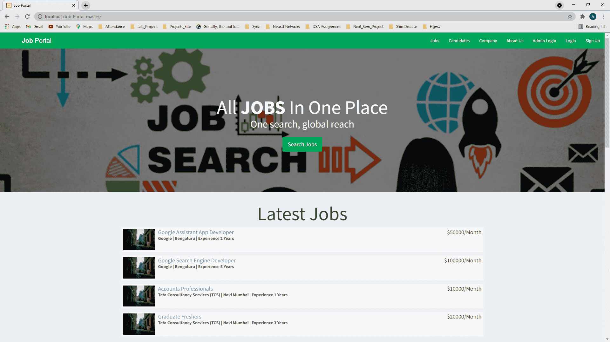

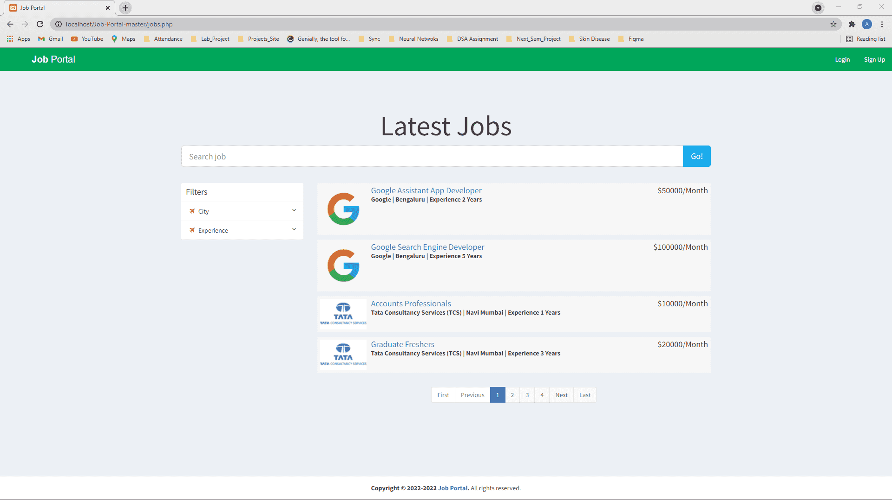

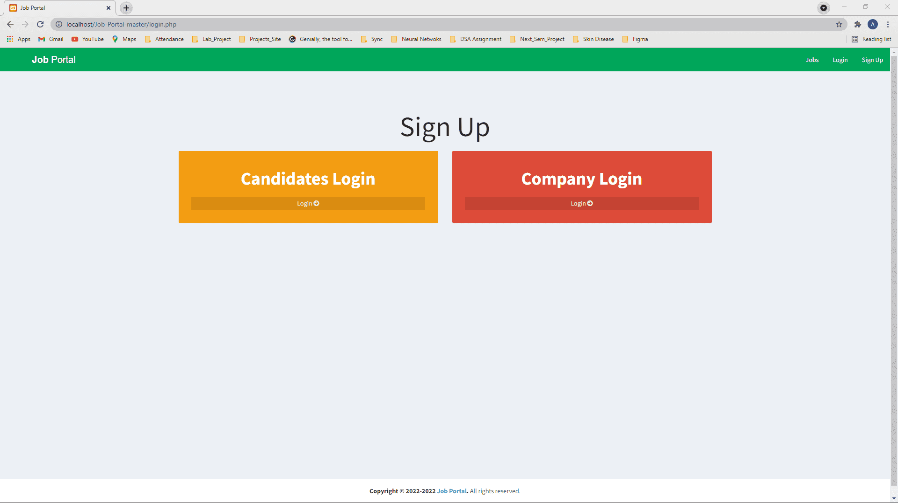

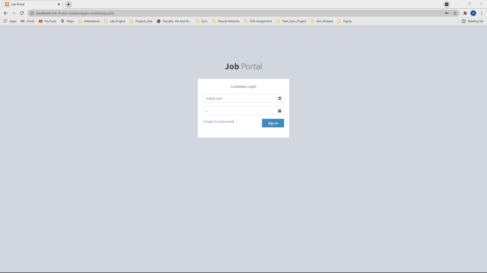

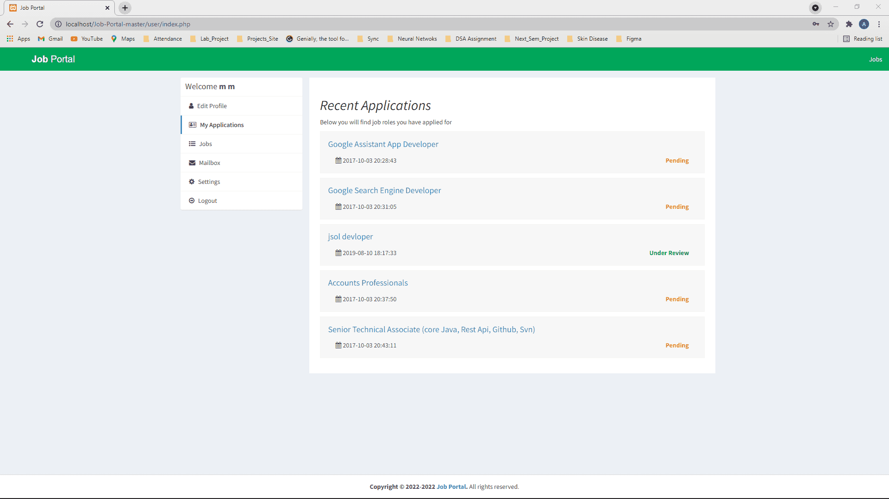

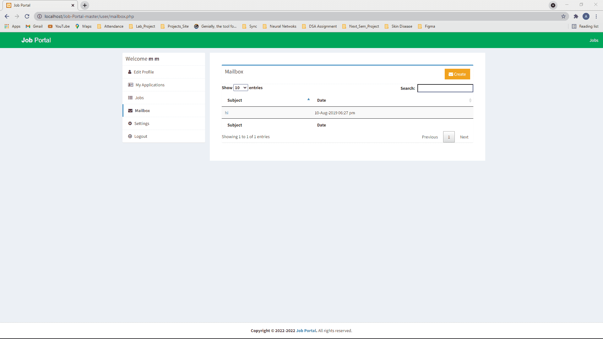

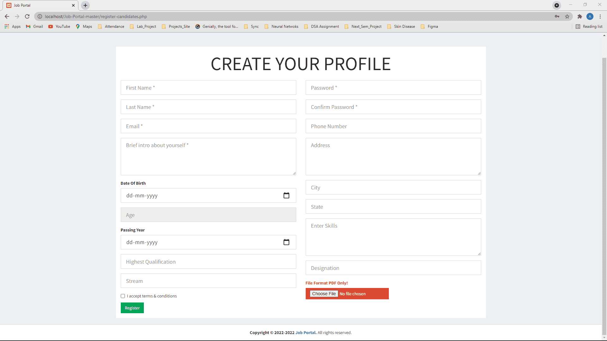

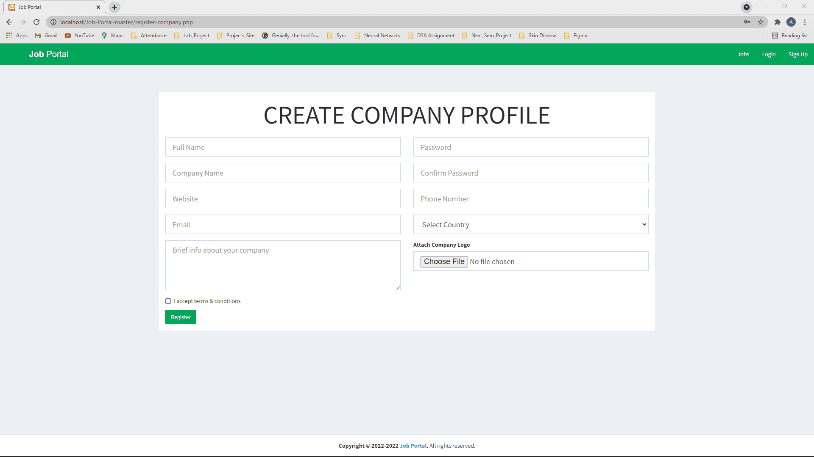

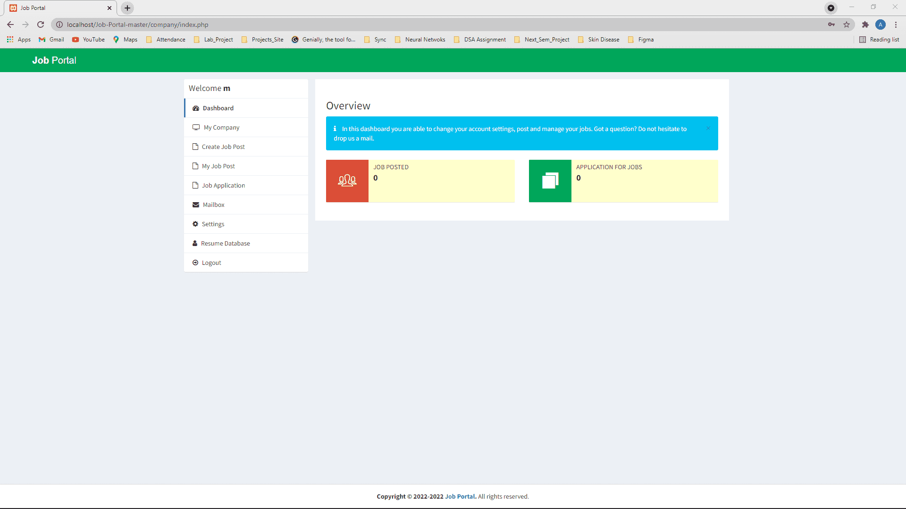

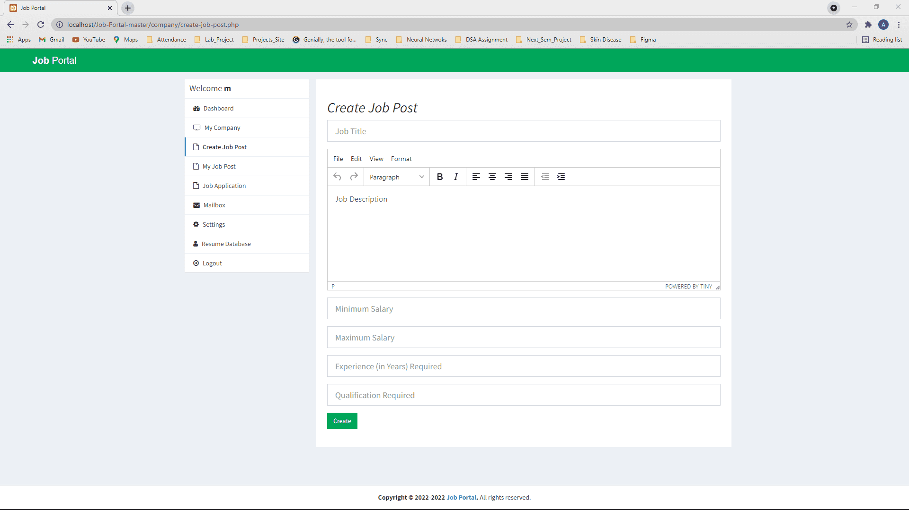

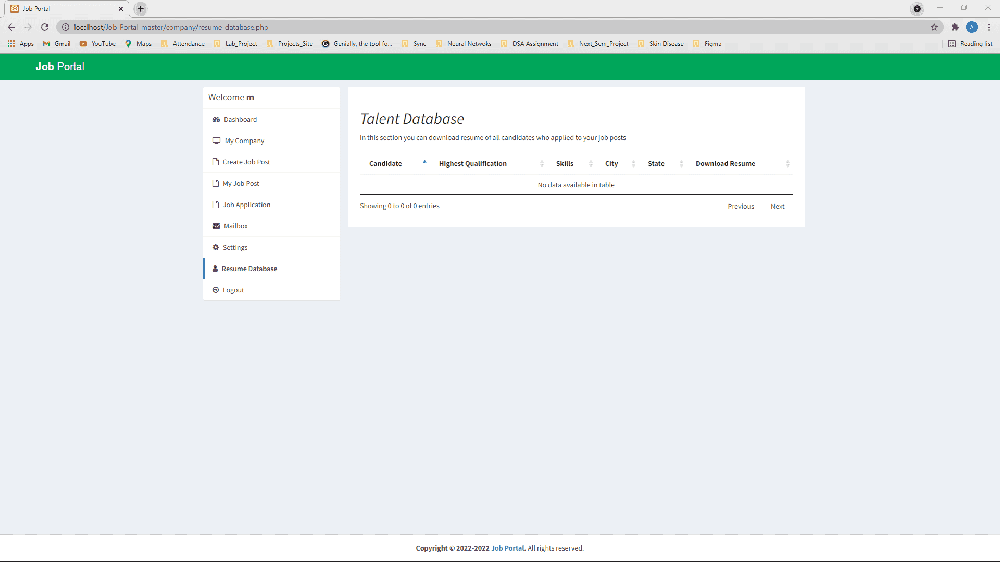

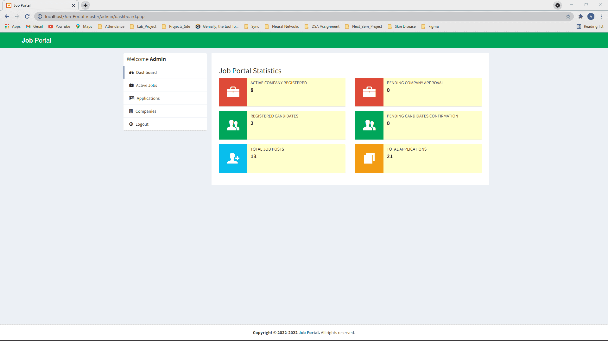

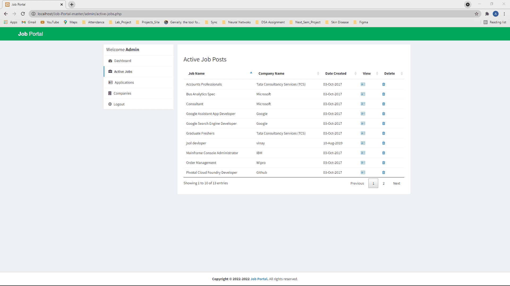

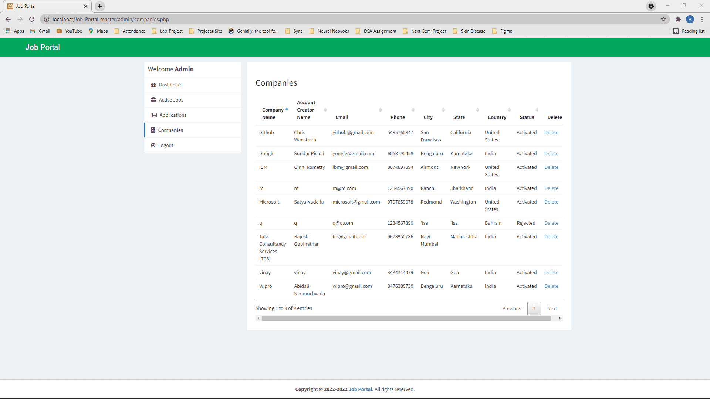

# Other Queries

## Retrieve company number from name 

```mysql
delimiter //
create function contact_from_company(input_companyname varchar(255))
returns varchar(255)
begin
	return (select contactno
		from company
		where company.companyname= input_companyname);
end //
delimiter ;

select * from contact_from_company(*some company name*);
```

**RA**
$$
\pi_\text{contactno} \text{(}
\sigma_\text{companyname='companyname'}
\text{(company))}
$$
**TRC**
$$
\{\text{t}| \exists \text{c} \in \text{company(}
\text{t[contactno]=c[contactno]} \land
\text{c[companyname]='companyname')}\}
$$
**DRC**
$$
\{<\text{co}>|
\exists \text{ic,n,cn,c,st,ci,w,e,p,a,l,cd,ac(}
<\text{ic,n,cn,c,st,ci,co,w,e,p,a,l,cd,ac}> \in \text{company} \land
\text{cn='companyname')}\}
$$

## Retrieve qualifying jobs

```mysql
delimiter //
create procedure job_from_qualification(input_id_user int(11))
begin
select companyname, jobtitle, description, minimumsalary, maximumsalary, experience
from users
where users.id_user=input_id_user
inner join job_post
on users.qualification=job_post.qualification;
end //
delimiter ;

call job_from_qualification(*some userid*);
```

**RA**
$$
\pi_\text{jobtitle,description,minimumsalary,maximumsalary,experience} \text{(}
\sigma_\text{id\_user='userid'}
\text{(users} \bowtie \text{job\_post))}
$$
**TRC**
$$
\{\text{t} | \exists \text{u}\in \text{users(}
\text{u[id\_user]='userid'} \land
\exists \text{j}\in \text{job\_post(} \\
\text{t[jobtitle]=j[jobtitle]} \land
\text{t[description]=j[description]} \land \\
\text{t[minimumsalary]=j[minimumsalary]} \land
\text{t[maximumsalary]=j[maximumsalary]} \land \\
\text{t[experience]=j[experience]} \land
\text{u[qualification]=j[qualification]))}\}
$$
**DRC**
$$
\{<\text{jt,desc,mins,maxs,ex}>|
\exists \text{iu,fn,ln,em,pa,ad,ci,st,con,q,s,py,dob,age,desg,res,h,act,abt,sk(} \\
<\text{iu,fn,ln,em,pa,ad,ci,st,con,q,s,py,dob,age,desg,res,h,act,abt,sk}>\in \text{users} \land
\text{iu='userid'} \land \\
\exists \text{ij,ic,crd(}
<\text{ij,ic,jt,desc,mins,maxs,ex,crd}>\in \text{job\_post))}\}
$$

## Retrieve jobs in a city

```mysql
SELECT j.companyname, j.jobtitle, j,description, j.minimumsalary, j.maximumsalary, j.experience
FROM job_post as j, (SELECT id_jobpost, city
				FROM job_post, company
				WHERE job_post.id_company= company.id_company) as c
WHERE j.id_jobpost=c.id_jobpost AND c.city='city';
```

**RA**
$$
\pi_\text{companyname,jobtitle,description,minimumsalary,maximumsalary,experience} \text{(}
\sigma_\text{city='city'}
\text{(job\_post}\bowtie \text{company))}
$$
**TRC**
$$
\{\text{t} | \exists \text{j} \in \text{job\_post(}
\text{t[jobtitle]=j[jobtitle]} \land \text{t[description]=j[description]} \land \\
\text{t[minimumsalary]=j[minimumsalary]} \land \text{t[maximumsalary]=j[maximumsalary]} \land
\text{t[experience]=j[experience]} \land \\
\exists \text{c}\in \text{company(}
\text{j[id\_company]=c[id\_company]} \land
\text{c[city]='city'))}\}
$$
**DRC**
$$
\{<\text{cn,jt,desc,mins,maxs,ex}>|
\exists \text{ij,ic,q,crd(}
<\text{ij,ic,jt,desc,mins,maxs,ex,crd}> \in \text{job\_post} \land \\
\exists \text{n,c,st,ci,co,w,e,p,ab,l,cd,a(}
<\text{ic,n,cn,c,s,ci,co,w,e,p,a,l,cd,ac}>\in \text{company} \land
\text{ci='city'))}\}
$$

## Retrieve user details if applied to a certain job

```mysql
delimiter //
create procedure resume_from_apply_jobpost(input_id_jobpost int(11))
begin
select id_user, email, resume
from users, apply_job_post
where apply_job_post.id_jobpost =input_id_jobpost and
apply_jobpost.id_user = users.id_user;
end //
delimiter ;

select * from resume_from_apply_jobpost(*some id_jobpost*);
```

**RA**
$$
\pi_\text{id\_user, email, resume} \text{(}
\sigma_\text{id\_jobpost='jobpostid'}
\text{(users} \bowtie \text{apply\_job\_post))}
$$
**TRC**
$$
\{\text{t}|\exists \text{u} \in \text{users(}
\text{t[id\_user]=u[id\_user]} \land \\
\text{t[email]=u[email]} \land
\text{t[resume]=u[resume]} \land \\
\exists \text{aj} \in \text{apply\_job\_post(}
\text{aj[id\_jobpost]='jobpostid'} \land
\text{u[id\_user]=aj[id\_user]))}\}
$$
**DRC**
$$
\{<\text{iu,em,res}>|
\exists \text{fn,ln,pa,ad,ci,st,con,q,s,py,dob,age,desg,h,act,abt,sk(} \\
<\text{iu,fn,ln,em,pa,ad,ci,st,con,q,s,py,dob,age,desg,res,h,act,abt,sk}>\in \text{users} \land \\
\exists \text{ia,ij,ic,stat(}
<\text{ia,ij,ic,iu,stat}> \in \text{apply\_job\_post} \land
\text{ij='jobpostid'))}\}
$$

## Retrieve qualified jobs greater than some salary

```mysql
delimiter //
create procedure job_from_minimumsalary(input_id_user int(11), input_minimumsalary varchar(255))
begin
select companyname, jobtitle, description, minimumsalary, maximumsalary, experience
from users
where users.id_user=input_id_user
inner join job_post
on users.qualification=job_post.qualification and job_post.maximumsalary>input_minimumsalary;
end //
delimiter ;

call job_from_minimumsalary(*some user_id*, *some minimumsalary*);
```

**RA**
$$
\pi_\text{jobtitle,description,minimumsalary,maximumsalary,experience} \text{(} \\
\sigma_{\text{id\_user='userid'} \land
\text{maximumsalary}>\text{'minimumsalary'}}
\text{(users} \bowtie \text{job\_post))}
$$
**TRC**
$$
\{\text{t} | \exists \text{u} \in \text{users(}
\text{u[id\_user]='userid'} \land
\exists \text{j} \in \text{job\_post(}
\\
\text{t[jobtitle]=j[jobtitle]} \land
\text{t[description]=j[description]} \land
\\
\text{t[minimumsalary]=j[minimumsalary]} \land
\text{t[maximumsalary]=j[maximumsalary]} \land 
\\
\text{t[experience]=j[experience]} \land
\text{u[qualification]=j[qualification]} \land
\\
\text{j[maximumsalary]>'minimumsalary'))}\}
$$
**DRC**
$$
\{<\text{jt,desc,mins,maxs,ex}>|
\exists \text{iu,fn,ln,em,pa,ad,ci,st,con,q,s,py,dob,age,desg,res,h,act,abt,sk(} \\
<\text{iu,fn,ln,em,pa,ad,ci,st,con,q,s,py,dob,age,desg,res,h,act,abt,sk}> \in \text{users} \land
\text{iu='userid'} \land \\
\exists \text{ij,ic,crd(}
<\text{ij,ic,jt,desc,mins,maxs,ex,crd}> \in \text{job\_post} \land
\text{maxs>'minimumsalary'))}\}
$$

## Retrieve users with applications sent out

```mysql
SELECT id_user,firstname,lastname
FROM users
WHERE id_user IN (SELECT id_user FROM apply_job_post);
```

**RA**
$$
\pi_\text{id\_user,firstname,lastname}
\text{(users} \bowtie \text{apply\_job\_post)}
$$
**TRC**
$$
\{\text{t}| \exists \text{u} \in \text{users(}
\text{t[id\_user]=u[id\_user]} \land
\text{t[firstname]=u[firstname]} \land \\
\text{t[lastname]=u[lastname]} \land
\exists \text{aj} \in \text{apply\_job\_post(}
\text{u[id\_user]=aj[id\_user]))}\}
$$
**DRC**
$$
\{<\text{iu,fn,ln}>|
\exists \text{em,pa,ad,ci,st,con,q,s,py,dob,age,desg,res,h,act,abt,sk(} \\
<\text{iu,fn,ln,em,pa,ad,ci,st,con,q,s,py,dob,age,desg,res,h,act,abt,sk}>\in \text{users} \land \\
\exists \text{ia,ij,ic,stat(}
<\text{ia,ij,ic,iu,stat}> \in \text{apply\_job\_post))}\}
$$

## Retrieve cities with jobs available

```mysql
SELECT city
FROM company
WHERE company.id_company IN (SELECT id_company FROM job_post);
```

**RA**
$$
\pi_\text{city}
\text{(company} \bowtie \text{job\_post)}
$$
**TRC**
$$
\{\text{t}| \exists \text{c} \in \text{company(}
\text{t[city]=c[city]} \land
\exists \text{j} \in \text{job\_post(}
\text{c[id\_company]=j[id\_company]))}\}
$$
**DRC**
$$
\{<ci>|
\exists \text{ic,n,cn,c,st,co,w,e,p,a,l,cd,ac(} \\
<\text{ic,n,cn,c,st,ci,co,w,e,p,a,l,cd,ac}> \in \text{company} \land \\
\exists \text{ij,jt,desc,mins,maxs,ex,crd(}
<\text{ij,ic,jt,desc,mins,maxs,ex,crd}> \in \text{job\_post))}\}
$$

## Check if company email exists

```mysql
SELECT email 
FROM company 
WHERE email ='$email';
```

**RA**

$$
\pi_\text{email} \text{(}
\sigma_\text{email='\$email'}
\text{(company)})
$$

**TRC**
$$
\{\text{t}|\exists \text{c} \in \text{company(}
\text{t[email]=c[email]} \land
\text{c[email]='\$email')}\}
$$
**DRC**
$$
\{<e>|
\exists \text{ic,n,cn,c,st,ci,co,w,p,a,l,cd,ac(}
<\text{ic,n,cn,c,st,ci,co,w,e,p,a,l,cd,ac}> \in \text{company} \land
\text{e='\$email')}\}
$$

## Check if user email exists

```mysql
SELECT email
FROM users
WHERE email ='$email';
```

**RA**
$$
\pi_\text{email} \text{(}
\sigma_\text{email='\$email'}
\text{(users))}
$$
**TRC**
$$
\{\text{t}| \exists \text{u} \in \text{users(}
\text{t[email]=u[email]} \land
\text{u[email]='\$email')}\}
$$
**DRC**
$$
\{<em>|
\exists \text{iu,fn,ln,pa,ad,ci,st,con,q,s,py,dob,age,desg,res,h,act,abt,sk(} \\
<\text{iu,fn,ln,em,pa,ad,ci,st,con,q,s,py,dob,age,desg,res,h,act,abt,sk}> \in \text{users} \\
\land \text{em='email')}\}
$$

## Retrieve jobpost details from matching jobpost

```mysql
SELECT *
FROM job_post
WHERE id_jobpost ='$_GET[id]';
```

**RA**
$$
\sigma_\text{id\_jobpost='\$\_{GET[id]}}
\text{(job\_post)}
$$

**TRC**
$$
\{\text{t}| \exists \text{j} \in \text{job\_post(}
\text{t[id\_jobpost]=j[id\_jobpost]} \land
\text{t[id\_company]=j[id\_company]} \land \\
\text{t[jobtitle]=j[jobtitle]} \land
\text{t[description]=j[description]} \land
\text{t[minimumsalary]=j[minimumsalary]} \land \\
\text{t[maximumsalary]=j[maximum salary]} \land
\text{t[experience]=j[experience]} \land \\
\text{t[qualification]=j[qualification]} \land 
\text{t[createdat]=j[createdat]} \land
\text{j[id\_jobpost]='\$\_GET[id]')}\}
$$

**DRC**

$$
\{<\text{ij,ic,jt,desc,mins,max,ex,q,crd}>|
<\text{ij,ic,jt,desc,mins,max,ex,q,crd}> \in \text{job\_post} \\
\land \text{ij='\$\_GET[id]'}\}
$$
## Retrieve company details

```mysql
SELECT id_company,companyname,email,active
FROM company
WHERE email='$email' AND password='$password';
```

**RA**
$$
\pi_\text{id\_company,companyname,email,active} \text{(}
\sigma_{\text{email='\$email'} \land
\text{password ='\$password'}}
\text{(company))}
$$
**TRC**
$$
\{t| \exists \text{c} \in \text{company(}
\text{t[id\_company]=c[id\_company]} \land \\
\text{t[companyname]=c[companyname]} \land
\text{t[email]=c[email]} \land \\
\text{t[active]=c[active]} \land
\text{c[email]='\$email')}\}
$$
**DRC**
$$
\{<\text{ic,cn,e,ac}>|
\exists \text{n,c,st,ci,co,w,p,a,l,cd(} \\
<\text{ic,n,cn,c,st,ci,co,w,e,p,a,l,cd,ac}> \in \text{company}
\\ \land
\text{p='\$password'} \land
\text{e='\$email')}\}
$$

## Retrieve applications that user has applied for

```mysql
SELECT *
FROM apply_job_post
WHERE id_user='$_SESSION[id_user]' AND id_jobpost='$row[id_jobpost]';
```

**RA**
$$
\sigma_{\text{id\_user=‘\$\_SESSION[id\_user]'} \land
\text{id\_jobpost='\$row[id\_jobpost]'}}
\text{(apply\_job\_post)}
$$
**TRC**
$$
\{\text{t}| \exists \text{aj} \in \text{apply\_job\_post(}
\text{t[id\_apply]=aj[id\_apply]} \land
\text{t[id\_jobpost]=aj[id\_jobpost]} \land \\
\text{t[id\_company]=aj[id\_company]} \land
\text{t[id\_user]=c[id\_user]} \land
\text{t[status]=aj[status]} \land \\
\text{aj[id\_user]='\$\_SESSION[id\_user]} \land
\text{id\_jobpost='\$row[id\_jobpost])}\}
$$
**DRC**
$$
\{<\text{ia,ij,ic,iu,stat}>|
<\text{ia,ij,ic,iu,stat}> \in \text{apply\_job\_post} \land \\
\text{iu=‘\$\_SESSION[id\_user]'} \land
\text{ij='\$row[id\_jobpost]'}\}
$$

## Retrieve cities in a state

```mysql
SELECT *
FROM cities
WHERE state_id ="$_POST[id]";
```

**RA**
$$
\sigma_\text{state\_id ='\$\_POST[id]}
\text{(cities)}
$$

**TRC**
$$
\{\text{t}| \exists \text{ci} \in \text{cities(}
\text{t[id]=ci[id]} \land
\text{t[name]=ci[name]} \land \\
\text{t[state\_id]=ci[state\_id]} \land
\text{c[state\_id]='\$\_POST[id]')}\}
$$
**DRC**
$$
\{<\text{id,n,si}>|
<\text{id,n,si}> \in \text{cities} \land
\text{si=‘\$\_POST[id]}\}
$$

## Retrieve certain jobpost and their company details

```mysql
SELECT * job_post
INNER JOIN company
ON job_post
WHERE id_jobpost='$_GET[id]';
```

**RA** 
$$
\sigma_\text{id\_jobpost='\$\_GET[id]'}
\text{(job\_post} \bowtie \text{company)}
$$
**TRC**
$$
\{\text{t}| \exists \text{j} \in \text{job\_post(}
\text{t[id\_jobpost]=j[id\_jobpost]} \land
\text{t[id\_company]=j[id\_company]} \land \\
\text{t[jobtitle]=j[jobtitle]} \land
\text{t[description]=j[description]} \land \\
\text{t[minimumsalary]=j[minimumsalary]} \land
\text{t[maximumsalary]=j[maximumsalary]} \land \\
\text{t[experience]=j[experience]} \land
\text{t[qualification]=j[qualification]} \land \\
\text{t[createdat]=j[createdat]} \land
\text{j[id\_jobpost]='\$\_GET[id]'} \land \\
\exists \text{c} \in \text{company(}
\text{t[id\_company]=c[id\_company]} \land \\
\text{t[name]=c[name]} \land
\text{t[companyname]=c[companyname]} \land \\
\text{t[country]=c[country]} \land
\text{t[state]=c[state]} \land \\
\text{t[city]=c[city]} \land
\text{t[contactno]=c[contactno]} \land \\
\text{t[website]=c[website]} \land
\text{t[email]=c[email]} \land \\
\text{t[password]=c[password]} \land
\text{t[aboutme]=c[aboutme]} \land \\
\text{t[logo]=c[logo]} \land
\text{t[createdAt]=c[createdAt]} \land
\text{t[active]=c[active]))}\}
$$
**DRC**
$$
\{<\text{ij,ic,jt,desc,mins,max,ex,q,crd,n,cn,c,st,ci,co,w,e,p,a,l,cd,ac}>| \\
<\text{ij,ic,jt,desc,mins,max,ex,q,crd}> \in \text{job\_post} \land \\
<\text{ic,n,cn,c,st,ci,co,w,e,p,a,l,cd,ac}> \in \text{company} \land
\text{ij='\$\_GET[id]'}\}
$$

## Triggers

The following are the triggers used for this project. Note that: Since the `id` uses auto incremented, we do not need to explicitly specify an ID, so we write `null` instead.

Add inserted to the logs when a new user is created.

```mysql
CREATE TRIGGER 'insertLog'
AFTER INSERT ON 'users'
FOR EACH ROW
INSERT INTO logs VALUES(null, NEW.id_user, "Inserted" , NOW())
```

Add updated to the logs when a user’s detail(s) are updated

```mysql
CREATE TRIGGER 'updateLog'
AFTER UPDATE ON 'users'
FOR EACH ROW
INSERT INTO logs VALUES(null, NEW.id_user, "Updated" , NOW())
```

Add deleted to the logs when a user is deleted

```mysql
CREATE TRIGGER 'deleteLog'
AFTER DELETE ON 'users'
FOR EACH ROW
INSERT INTO logs VALUES(null, OLD.id_user, "Deleted" , NOW())
```

# Usage

The following are the steps to run this project yourself

1. Clone the [Github Repo](https://github.com/AhmedThahir/DBMS/)

2. Import the `git_repos_jobportal.sql` in the xampp mysql database

3. Paste the `Job_Portal` folder into `htdocs` folder. (found in WAMPP, XAMMP, MAMPP installation folder)

4. Start the Apache and Mysql services from the MAMPP server (mac), XAMPP server (windows).

5. Run the following commands in the terminal

   ```bash
   cd Job-Portal
   open db.php
   ```

6. Check that credentials for username and password are matching according to your system.

7. Go to `localhost` and job posts will now be visible.

8. Login with any of the below default accounts

|   Type    | Username | Password |
| :-------: | :------: | :------: |
|   Admin   |  admin   |  12345   |
| Candidate | m@m.com  |    m     |
|  Company  | m@m.com  |    m     |

# References

[1] “Need for DBMS,” GeeksforGeeks, Aug. 23, 2016. https://www.geeksforgeeks.org/need-for-dbms/ (accessed May 02, 2022).

[2] “Schema Integration in DBMS,” GeeksforGeeks, Oct. 11, 2018. https://www.geeksforgeeks.org/schema-integration-in-dbms/ (accessed May 01, 2022).

[3] “Normal Forms in DBMS,” GeeksforGeeks, Jul. 08, 2015. https://www.geeksforgeeks.org/normal-forms-in-dbms/ (accessed May 01, 2022).

[4] F. Nelson, Job-Portal. 2021. Accessed: Apr. 08, 2022. [Online]. Available: https://github.com/fulfilen/job-portal

[5] “Introduction of ER Model,” GeeksforGeeks, Oct. 13, 2015. https://www.geeksforgeeks.org/introduction-of-er-model/ (accessed Apr. 28, 2022).

[6] “Relational Model in DBMS,” GeeksforGeeks, Oct. 27, 2015. https://www.geeksforgeeks.org/relational-model-in-dbms/ (accessed Apr. 21, 2022).

[7] “Introduction of Relational Algebra in DBMS,” GeeksforGeeks, Jul. 02, 2015. https://www.geeksforgeeks.org/introduction-of-relational-algebra-in-dbms/ (accessed Apr. 21, 2022).

[8] “Functional Dependency and Attribute Closure,” GeeksforGeeks, Dec. 23, 2016. https://www.geeksforgeeks.org/functional-dependency-and-attribute-closure/ (accessed Apr. 22, 2022).

[9] “ACID Properties in DBMS,” GeeksforGeeks, Aug. 07, 2016. https://www.geeksforgeeks.org/acid-properties-in-dbms/ (accessed Apr. 25, 2022).

[10] “Concurrency Control in DBMS,” GeeksforGeeks, Dec. 29, 2015. https://www.geeksforgeeks.org/concurrency-control-in-dbms/ (accessed Apr. 26, 2022).

[11] “Database Management System (DBMS),” GeeksforGeeks. https://www.geeksforgeeks.org/dbms/ (accessed Apr. 22, 2022).
